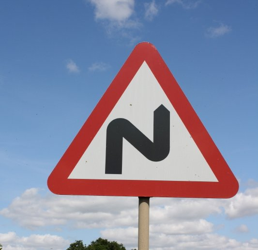

# **Traffic Sign Recognition**

---

**Build a Traffic Sign Recognition Project**

The goals / steps of this project are the following:
* Load the data set (see below for links to the project data set)
* Explore, summarize and visualize the data set
* Design, train and test a model architecture
* Use the model to make predictions on new images
* Analyze the softmax probabilities of the new images
* Summarize the results with a written report


[//]: # (Image References)

[image1]: ./examples/visualization.jpg "Visualization"
[image2]: ./examples/grayscale.jpg "Grayscaling"
[image3]: ./examples/random_noise.jpg "Random Noise"
[image4]: ./examples/placeholder.png "Traffic Sign 1"
[image5]: ./examples/placeholder.png "Traffic Sign 2"
[image6]: ./examples/placeholder.png "Traffic Sign 3"
[image7]: ./examples/placeholder.png "Traffic Sign 4"
[image8]: ./examples/placeholder.png "Traffic Sign 5"

## Rubric Points
### Here I will consider the [rubric points](https://review.udacity.com/#!/rubrics/481/view) individually and describe how I addressed each point in my implementation.  

---
### Writeup


### Data Set Summary & Exploration

#### 1. Provide a basic summary of the data set. In the code, the analysis should be done using python, numpy and/or pandas methods rather than hardcoding results manually.

I used the pandas library to calculate summary statistics of the traffic
signs data set:

* The size of training set is ?
* The size of the validation set is ?
* The size of test set is ?
* The shape of a traffic sign image is ?
* The number of unique classes/labels in the data set is ?

#### 2. Include an exploratory visualization of the dataset.

Here is an exploratory visualization of the data set. It is a bar chart showing how the data is distributed across the 43 classes of traffic sign

||
|:---:|
|*Figure 1: Data distribution*|

### Design and Test a Model Architecture

#### 1. Describe how you preprocessed the image data. What techniques were chosen and why did you choose these techniques? Consider including images showing the output of each preprocessing technique. Pre-processing refers to techniques such as converting to grayscale, normalization, etc. (OPTIONAL: As described in the "Stand Out Suggestions" part of the rubric, if you generated additional data for training, describe why you decided to generate additional data, how you generated the data, and provide example images of the additional data. Then describe the characteristics of the augmented training set like number of images in the set, number of images for each class, etc.)

I did minimal preprocessing on the dataset in this case. I decided to preserve the color channels, since color is often part of the classification of the traffic sign, and normalized the data.

I did not do any data augmentation either, instead choosing to rely on the model itself.

#### 2. Describe what your final model architecture looks like including model type, layers, layer sizes, connectivity, etc.) Consider including a diagram and/or table describing the final model.

My final model consisted of the following layers:

```
Layer (type)                    Output Shape         Param #     Connected to                     
==================================================================================================
input_13 (InputLayer)           (None, 32, 32, 3)    0                                            
__________________________________________________________________________________________________
conv2d_128 (Conv2D)             (None, 32, 32, 18)   72          input_13[0][0]                   
__________________________________________________________________________________________________
conv2d_134 (Conv2D)             (None, 32, 32, 18)   72          input_13[0][0]                   
__________________________________________________________________________________________________
conv2d_129 (Conv2D)             (None, 32, 32, 18)   2934        conv2d_128[0][0]                 
__________________________________________________________________________________________________
conv2d_135 (Conv2D)             (None, 32, 32, 18)   8118        conv2d_134[0][0]                 
__________________________________________________________________________________________________
dropout_87 (Dropout)            (None, 32, 32, 18)   0           conv2d_129[0][0]                 
__________________________________________________________________________________________________
dropout_90 (Dropout)            (None, 32, 32, 18)   0           conv2d_135[0][0]                 
__________________________________________________________________________________________________
max_pooling2d_47 (MaxPooling2D) (None, 16, 16, 18)   0           dropout_87[0][0]                 
__________________________________________________________________________________________________
max_pooling2d_49 (MaxPooling2D) (None, 16, 16, 18)   0           dropout_90[0][0]                 
__________________________________________________________________________________________________
conv2d_140 (Conv2D)             (None, 32, 32, 32)   128         input_13[0][0]                   
__________________________________________________________________________________________________
conv2d_130 (Conv2D)             (None, 16, 16, 32)   5216        max_pooling2d_47[0][0]           
__________________________________________________________________________________________________
conv2d_136 (Conv2D)             (None, 16, 16, 32)   5216        max_pooling2d_49[0][0]           
__________________________________________________________________________________________________
dropout_93 (Dropout)            (None, 32, 32, 32)   0           conv2d_140[0][0]                 
__________________________________________________________________________________________________
conv2d_131 (Conv2D)             (None, 16, 16, 32)   9248        conv2d_130[0][0]                 
__________________________________________________________________________________________________
conv2d_137 (Conv2D)             (None, 16, 16, 32)   9248        conv2d_136[0][0]                 
__________________________________________________________________________________________________
max_pooling2d_51 (MaxPooling2D) (None, 16, 16, 32)   0           dropout_93[0][0]                 
__________________________________________________________________________________________________
dropout_88 (Dropout)            (None, 16, 16, 32)   0           conv2d_131[0][0]                 
__________________________________________________________________________________________________
dropout_91 (Dropout)            (None, 16, 16, 32)   0           conv2d_137[0][0]                 
__________________________________________________________________________________________________
conv2d_141 (Conv2D)             (None, 16, 16, 32)   1056        max_pooling2d_51[0][0]           
__________________________________________________________________________________________________
max_pooling2d_48 (MaxPooling2D) (None, 8, 8, 32)     0           dropout_88[0][0]                 
__________________________________________________________________________________________________
max_pooling2d_50 (MaxPooling2D) (None, 8, 8, 32)     0           dropout_91[0][0]                 
__________________________________________________________________________________________________
dropout_94 (Dropout)            (None, 16, 16, 32)   0           conv2d_141[0][0]                 
__________________________________________________________________________________________________
conv2d_132 (Conv2D)             (None, 8, 8, 48)     13872       max_pooling2d_48[0][0]           
__________________________________________________________________________________________________
conv2d_138 (Conv2D)             (None, 8, 8, 48)     13872       max_pooling2d_50[0][0]           
__________________________________________________________________________________________________
max_pooling2d_52 (MaxPooling2D) (None, 8, 8, 32)     0           dropout_94[0][0]                 
__________________________________________________________________________________________________
conv2d_133 (Conv2D)             (None, 8, 8, 48)     20784       conv2d_132[0][0]                 
__________________________________________________________________________________________________
conv2d_139 (Conv2D)             (None, 8, 8, 48)     20784       conv2d_138[0][0]                 
__________________________________________________________________________________________________
conv2d_142 (Conv2D)             (None, 8, 8, 32)     1056        max_pooling2d_52[0][0]           
__________________________________________________________________________________________________
dropout_89 (Dropout)            (None, 8, 8, 48)     0           conv2d_133[0][0]                 
__________________________________________________________________________________________________
dropout_92 (Dropout)            (None, 8, 8, 48)     0           conv2d_139[0][0]                 
__________________________________________________________________________________________________
dropout_95 (Dropout)            (None, 8, 8, 32)     0           conv2d_142[0][0]                 
__________________________________________________________________________________________________
concatenate_13 (Concatenate)    (None, 8, 8, 128)    0           dropout_89[0][0]                 
                                                                 dropout_92[0][0]                 
                                                                 dropout_95[0][0]                 
__________________________________________________________________________________________________
flatten_11 (Flatten)            (None, 8192)         0           concatenate_13[0][0]             
__________________________________________________________________________________________________
dense_21 (Dense)                (None, 128)          1048704     flatten_11[0][0]                 
__________________________________________________________________________________________________
dropout_96 (Dropout)            (None, 128)          0           dense_21[0][0]                   
__________________________________________________________________________________________________
dense_22 (Dense)                (None, 43)           5547        dropout_96[0][0]                 
==================================================================================================
Total params: 1,165,927
Trainable params: 1,165,927
Non-trainable params: 0
```


#### 3. Describe how you trained your model. The discussion can include the type of optimizer, the batch size, number of epochs and any hyperparameters such as learning rate.

To train the model, I used an Adadelta optimizer, a batch size of 25, and trained for a variable number of epochs as I used an early stopper from keras.

To train the model, I first attempted to use SGD with a learning rate of 0.01 and an Adam optimizer, but I found that with the Adadelta optimizer the network converged much more quickly than the Adam optimizer.

The network's optimal number of epochs seem to be around 11-12, however this changed as I increased the dropout.

#### 4. Describe the approach taken for finding a solution and getting the validation set accuracy to be at least 0.93. Include in the discussion the results on the training, validation and test sets and where in the code these were calculated. Your approach may have been an iterative process, in which case, outline the steps you took to get to the final solution and why you chose those steps. Perhaps your solution involved an already well known implementation or architecture. In this case, discuss why you think the architecture is suitable for the current problem.

My final model results were:
* training set accuracy of 97.17%
* validation set accuracy of 96.46%
* test set accuracy of 88.07%

I used an iterative approach using two different network architectures, starting with the base network and tuning the hyperparameters to try to get a better result. The two architectures I tried were LeNet and a block of Inception V1.

The LeNet architecture performed within specifications, coming in around 94% validation accuracy pretty consistently, and training very quickly with the Adadelta optimizer. However with Keras's functional model I tried the inception network, and with some tuning I was able to achieve about 96% accuracy at a validation loss of 1.2, vs about 94% accuracy and 1.9 validation loss of the LeNet inspired architecture.

Both networks went through similar tuning procedures, however I'll focus on the inception model as that was the one that performed better. I first tried a relatively shallow version, with only 2 Conv2D nets per tower, and found that as the training loss decreased, the validation loss stopped decreasing about 4-5 epochs in. I tried to mitigate this with dropout, but with only minor improvements.

Next I tried reducing the hidden units in the Conv2D net, while increasing the depth of all three of the towers. This resulted in a significant improvement in validation accuracy, going from about 91% to about 94%.  

Next, I reduced the hidden units in the couple layers of all three towers, then increased the hidden units in the last couple layers, this pushed the validation accuracy up to the 96% that it is currently at.

Finally I added in dropout after every maxpooling layer in all three of the towers, and in the final classifier. This resulted in negligible improvements, increasing the number of epochs it took to reach 1.2 validation loss and allowing it to reach it more consistently, however I felt it was worth keeping in.

### Test a Model on New Images

#### 1. Choose five German traffic signs found on the web and provide them in the report. For each image, discuss what quality or qualities might be difficult to classify.

Here are five German traffic signs that I found on the web:

||||||
|:---:|:---:|:---:|:---:|:---:|
|*Double Curve*|*No Entry*|*No Passing*|*Speed limit (80km/h)*|*Turn Right Ahead*|

The first, second, and fourth images would probably be very easy to classify, as they are very similar to the training dataset and have ideal conditions. However the third image is on a completely white background, which may make it more difficult as the network may not have generalized that well. In addition, the final image is on a sharp angle, which may also make it difficult for the network to classify.

#### 2. Discuss the model's predictions on these new traffic signs and compare the results to predicting on the test set. At a minimum, discuss what the predictions were, the accuracy on these new predictions, and compare the accuracy to the accuracy on the test set (OPTIONAL: Discuss the results in more detail as described in the "Stand Out Suggestions" part of the rubric).

Here are the results of the prediction:

| Image			        |     Prediction	        					|
|:---------------------:|:---------------------------------------------:|
| Double Curve      		| Beware Ice and Snow   									|
| Speed limit 80km/h     			| Speed limit 30km/h 										|
| No passing					| No passing											|
| Turn Right Ahead	      		| Turn Right Ahead					 				|
| No Entry			| No Entry      							|


The model was able to correctly guess 3 of the 5 traffic signs, which gives an accuracy of 60%. This compares unfavorably to the accuracy on the test set of 89%. This indicates a lack of generalization of the model to new kinds of training data, and may be improved with data augmentation.

#### 3. Describe how certain the model is when predicting on each of the five new images by looking at the softmax probabilities for each prediction. Provide the top 5 softmax probabilities for each image along with the sign type of each probability. (OPTIONAL: as described in the "Stand Out Suggestions" part of the rubric, visualizations can also be provided such as bar charts)

The code for making predictions on my final model is located in the 12th cell of the Ipython notebook.

For the first image, the model is relatively sure that this is a Beware of ice and snow sign (probability of 0.869), and the image does not contain a beware of ice and snow sign. The top five soft max probabilities were

Image 1: Double curve

| Probability         	|     Prediction	        					|
|:---------------------:|:---------------------------------------------:|
| .869         			| Beware of ice/snow   									|
| .099     				| Right-of-way at the next intersection 										|
| .016					| Children crossing											|
| .006	      			| Bicycles crossing					 				|
| .003				    | Dangerous curve to the right      							|

Image 2: Speed limit (80km/h)

| Probability         	|     Prediction	        					|
|:---------------------:|:---------------------------------------------:|
| .651         			| Speed limit (50km/h) 									|
| .259     				| Speed limit (80km/h)						|
| .070					| Speed limit (60km/h)											|
| .014	      			| Speed limit (30km/h)					 				|
| .004				    | No vehicles      							|

Image 3: No passing

| Probability         	|     Prediction	        					|
|:---------------------:|:---------------------------------------------:|
| .999         			| No passing   									|
| .001     				| No passing for vehicles over 3.5 metric tons 										|
| .000					| End of no passing											|
| .000	      			| Vehicles over 3.5 metric tons prohibited					 				|
| .000				    | Priority road      							|

Image 4: Turn right ahead

| Probability         	|     Prediction	        					|
|:---------------------:|:---------------------------------------------:|
| .986         			| Turn right ahead   									|
| .137     				| Roundabout mandatory 										|
| .000					| Speed limit (100km/h)											|
| .000	      			| Keep left					 				|
| .000				    | Go straight or left      							|

Image 5: No entry

| Probability         	|     Prediction	        					|
|:---------------------:|:---------------------------------------------:|
| .999         			| No entry   									|
| .000     				| Stop 										|
| .000					| Speed limit (30km/h)											|
| .000	      			| Speed limit (20km/h)				 				|
| .000				    | No passing for vehicles over 3.5 metric tons	|


### (Optional) Visualizing the Neural Network (See Step 4 of the Ipython notebook for more details)
#### 1. Discuss the visual output of your trained network's feature maps. What characteristics did the neural network use to make classifications?
